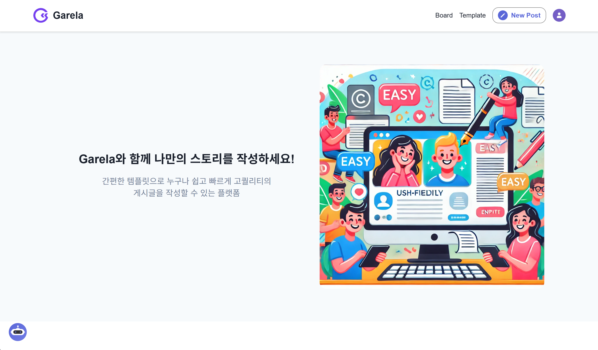
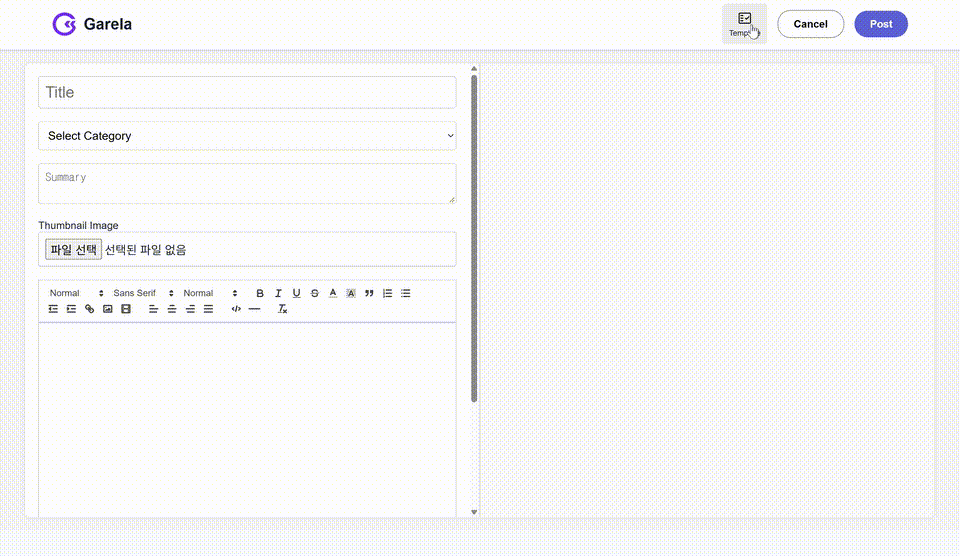
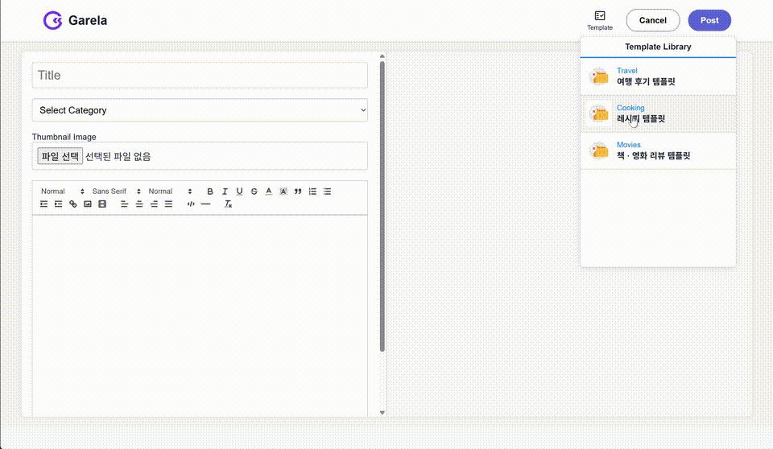
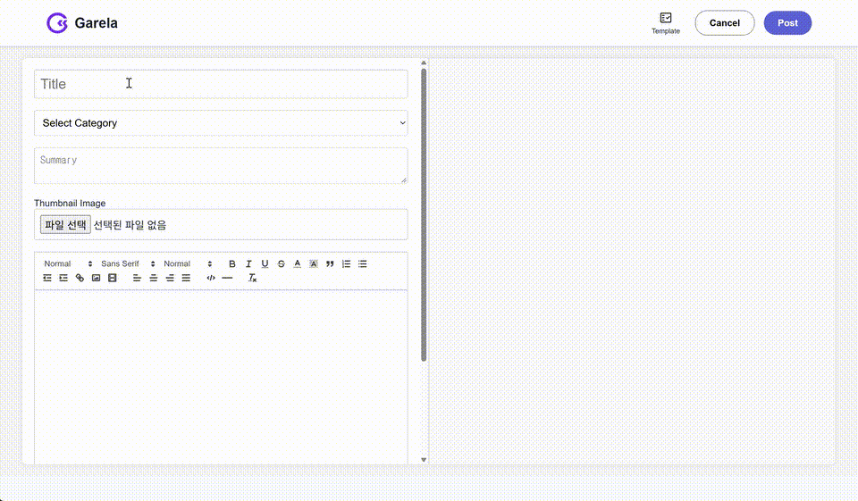
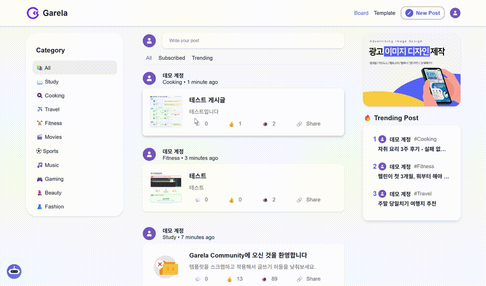
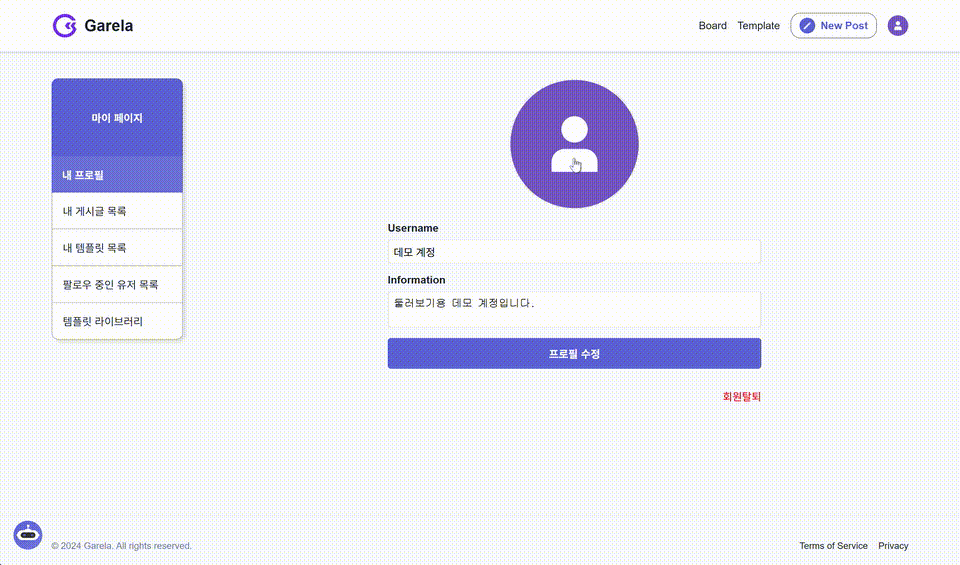

# 🚀 Garela Community

<div align="center">
  
</div>

<br/>

## 템플릿 하나로 완성도 높은 글을 쓰고 공유하는 커뮤니티

<div align="center">
  
  
</div>

<br/>

## 🛎️ 서비스 소개

- Garela Community는 커뮤니티에 공유된 마크다운 템플릿을 스크랩해 글쓰기 에디터에 바로 적용하고, 누적된 게시글 데이터를 기반으로 AI 챗봇에게 질문할 수 있는 지식 공유 커뮤니티 플랫폼입니다.
- 대상 사용자: 글쓰기 진입장벽을 느끼는 커뮤니티 이용자

```md
1. 템플릿 탐색 및 스크랩: 커뮤니티에 공유된 유용한 게시글 템플릿을 조회하고 스크랩한다.
2. 손쉬운 게시글 작성: 스크랩한 템플릿을 불러와 쉽고 빠르게 게시글을 작성 및 발행한다.
3. 커뮤니티 상호작용: 발행된 게시글을 공유하거나, 다른 유저의 게시글에 좋아요/댓글을 남기며 커뮤니케이션한다.
4. AI 챗봇 활용: 커뮤니티 내 누적된 게시글 데이터를 바탕으로 챗봇에게 질문해 원하는 정보를 빠르게 획득한다.
```

<br/>

## ❓ 배경 및 해결 목표

> **"유용한 정보가 있는데, 막상 처음부터 구조를 잡고 글로 정리하려니 막막하네요."**

UX 리서치 기관 닐슨 노먼 그룹(NN/g)의 '참여 불평등(90-9-1)' 법칙에 따르면, 커뮤니티 유저의 90%는 글을 읽기만 하며 단 1%만이 새로운 콘텐츠를 생산합니다. 일반적인 게시판은 글의 포맷팅을 전적으로 개인 역량에 의존하기 때문에, 텅 빈 에디터 앞에서 느끼는 '백지 증후군'이 콘텐츠 생산을 가로막는 가장 큰 진입 장벽이 됩니다.

Garela Community는 '템플릿 스크랩 및 적용' 기능으로 이 문제를 해결하고자 기획되었습니다.

- **접근성**: 검증된 템플릿을 스크랩해 에디터에 바로 불러와, 백지 증후군 없이 누구나 쉽게 글쓰기에 참여할 수 있게 합니다.
- **표준화**: 템플릿 공유 시스템으로 개인 역량에 의존하던 게시글 가독성을 상향 평준화합니다.
- **지식 탐색**: 누적된 게시글 데이터를 AI 챗봇으로 대화하듯 탐색할 수 있게 합니다.

<br/>

## ⭐ 주요 기능

### 1️⃣ 템플릿 스크랩 & 적용 글쓰기

커뮤니티에 공유된 템플릿을 마이페이지에 스크랩해두고, 글쓰기 에디터에서 바로 불러와 뼈대를 직접 잡을 필요 없이 내용만 채워 빠르게 게시글을 발행할 수 있습니다.

<div align="center">
  
</div>

### 2️⃣ 템플릿 작성 및 공유

Quill 에디터로 나만의 템플릿을 직접 만들어 템플릿 게시판에 공유할 수 있습니다. 공유된 템플릿은 다른 사용자가 스크랩해 자신의 글쓰기에 재사용할 수 있습니다.

<div align="center">
  
</div>

### 3️⃣ Quill 기반 에디터로 글 작성 · 수정

마크다운 문법 기반의 Quill 에디터로 글을 작성·수정합니다. 첨부한 이미지는 AWS S3에 업로드되어 URL로 렌더링됩니다.

<div align="center">
  
</div>

### 4️⃣ 게시판 & 커뮤니티 상호작용

카테고리별 게시글 탐색, 트렌딩 랭킹, 댓글과 팔로우로 다른 사용자와 소통할 수 있습니다.

<div align="center">
  
</div>

### 5️⃣ AI 챗봇 Q&A

질문을 입력하면 질문에서 추출한 키워드가 포함된 게시글을 찾아 그 내용을 바탕으로 답변하고, 참고한 게시글을 함께 안내합니다.

<div align="center">
  
</div>

### 6️⃣ 마이페이지

내 프로필, 내가 쓴 게시글·템플릿, 팔로우 중인 유저, 스크랩한 템플릿 라이브러리를 한곳에서 관리할 수 있습니다.

<div align="center">
  
</div>

### 7️⃣ 회원가입 · 로그인

JWT 기반 인증으로 회원가입과 로그인을 지원합니다.

<br/>

## 🔧 기술 스택

> **Frontend**

     

> **Backend**

    

> **AI**

   

> **Infra**

 

<br/>

## 🏗️ 시스템 아키텍처

```
[React(CRA) 클라이언트]
        │  REST API
        ▼
[Node.js/Express API 서버] ── MySQL
        │  질문 + 게시글 키워드 컨텍스트 (HTTP)
        ▼
[Python/Flask AI 서버] ── LangChain ── OpenAI API
```

게시판·인증·템플릿 등 일반 API는 Node.js(Express)가 처리하고, LangChain 연동이 필요한 챗봇 응답 생성만 별도 Python(Flask) 프로세스(`ai` 서비스, 내부 포트 5001)가 담당합니다. `docker-compose.yml`로 db · backend · ai · frontend 4개 서비스를 함께 실행합니다.

<br/>

## 📁 프로젝트 구조

```
garela-community/
├─ garela-frontend/          # React(CRA) 클라이언트
│  └─ src/
│     ├─ api/
│     ├─ components/         # Navbar, ChatBot, Footer, auth, mypage ...
│     ├─ screen/             # Auth, Main, Home, Create, Edit
│     ├─ atom.ts             # Recoil 상태
│     └─ imgs/
├─ garela-backend/           # Express API + Python AI 서비스
│  ├─ routes/                # users, posts, templates, upload, chat
│  ├─ middleware/            # authenticateJWT
│  ├─ db/                    # init.sql
│  ├─ server.js
│  └─ langchain_service.py   # AI 서비스 (Flask, :5001)
├─ docs/                     # 회고 및 기술 경험 정리
└─ docker-compose.yml
```

<br/>

## 🚀 설치 및 실행

### 사전 요구사항

| 도구 | 버전 |
| ---- | ---- |
| Node.js | 18.x |
| Docker / Docker Compose | 권장 (미사용 시 Python 3.9, MySQL 8.0 별도 필요) |

### 1. 저장소 clone

```bash
git clone https://github.com/YeonShin/garela-community.git
cd garela-community
```

### 2. 환경변수 설정

```bash
cp garela-backend/.env.example garela-backend/.env
cp garela-frontend/.env.sample garela-frontend/.env
```

<details>
  <summary><b>[garela-backend/.env.example]</b></summary>

| 변수 | 필수 | 설명 | 위치 |
| ---- | :--: | ---- | ---- |
| `DB_HOST` / `DB_USER` / `DB_PASSWORD` / `DB_NAME` | ✅ | MySQL 접속 정보 | 로컬 MySQL 또는 Docker `db` 서비스 |
| `JWT_SECRET` | ✅ | 인증 토큰 서명 키 | 임의 문자열 |
| `AWS_REGION` / `AWS_ACCESS_KEY_ID` / `AWS_SECRET_ACCESS_KEY` / `S3_BUCKET_NAME` | ✅ | 게시글/템플릿 이미지 업로드(S3) | AWS 콘솔 |
| `OPENAI_API_KEY` | ✅ | 챗봇 답변 생성 | OpenAI 대시보드 |
| `PORT` | 선택 | 백엔드 포트 (기본 5000) | - |

</details>

### 3. 의존성 설치 (Docker 미사용 시)

```bash
cd garela-frontend && npm install
cd ../garela-backend && npm install
```

### 4. 실행

**Docker Compose (권장)**

```bash
docker compose up --build
```

**로컬 개별 실행**

```bash
# 1) MySQL을 로컬에 구동한 뒤 garela-backend/db/init.sql 실행
# 2) 아래 3개 프로세스를 각각 실행
cd garela-backend && npm start                      # :5000
cd garela-backend && python langchain_service.py     # :5001
cd garela-frontend && npm start                      # :3000
```

### 5. 접속

👉 http://localhost:3000 (프론트) · http://localhost:5000/api-docs (백엔드 API 문서, Swagger)

데모 계정으로 로그인하면 게시글 5개 · 템플릿 3개가 미리 등록되어 있어 바로 둘러볼 수 있습니다 (`garela-backend/db/seed.sql`, 최초 실행 시 자동 생성). 물론 회원가입해서 새 계정으로 이용해도 됩니다.

| 이메일 | 비밀번호 |
| ---- | ---- |
| `demo@garela.dev` | `demo1234` |

<br/>

## 📖 사용법

1. 회원가입 후 로그인합니다.
2. 게시판에서 마음에 드는 템플릿을 마이페이지에 스크랩합니다.
3. 글쓰기에서 스크랩한 템플릿을 불러와 내용만 채워 게시글을 발행합니다.
4. 게시판에서 다른 사용자의 글을 탐색하고, 댓글 · 좋아요 · 팔로우로 소통합니다.
5. 챗봇 아이콘을 눌러 커뮤니티 게시글 데이터를 기반으로 질문합니다.

<br/>

## ⛏️ 기술 경험 및 트러블슈팅

자세한 트러블슈팅 과정과 기술 선택 배경은 아래 문서에서 확인할 수 있습니다.

- [Quill 에디터 이미지 Base64 저장 한계 → S3 URL 참조 전환](docs/troubleshooting/01-quill-image-base64-to-s3.md) — 에디터 이미지 첨부 시 MySQL TEXT 컬럼 한도를 초과하던 문제를 S3 업로드로 해결한 과정
- [AI 챗봇: 벡터 DB 대신 키워드 매칭으로 구현 범위를 좁힌 이유](docs/troubleshooting/02-chatbot-keyword-vs-vector-db.md) — 4주라는 기간 제약 속에서 임베딩 검색 대신 키워드 기반 컨텍스트 필터링을 선택한 배경
- [인턴십 회고](docs/인턴십%20회고록.md)

<br/>

## 📌 문의

| <a href="https://github.com/YeonShin"></a> |
| :---: |
| **YeonShin**<br/>[@YeonShin](https://github.com/YeonShin) |
